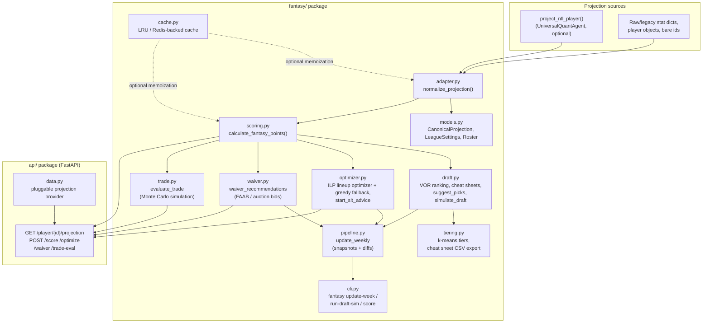

# Fantasy Super-Engine

A complete, standalone fantasy football engine: scoring, a draft assistant,
weekly roster management and lineup optimization, waiver/FA recommendations,
a trade analyzer with Monte Carlo simulation, player tiering with printable
cheat sheets, a weekly update pipeline, and a FastAPI web API. Python 3.11+,
fully typed, 100% line coverage on every module (`fantasy/` + `api/`).

It is deliberately **decoupled** from any specific NFL data source. Every
entry point accepts either a plain dict, a `project_nfl_player()`-shaped
result, a legacy short-name stat dict, or an arbitrary player object — see
[Canonical projection schema](#canonical-projection-schema) — so it drops
into any projection pipeline, including the sibling `UniversalQuantAgent`
NFL analytics repo (see [Migration guide](#migration-guide-plugging-into-universalquantagent)).

## Architecture



**Design decision — pydantic at the edges, plain dicts in the hot path.**
`fantasy/models.py` defines the real, validated schema (`CanonicalProjection`,
`LeagueSettings`, `RosterRequirements`, `Roster`) used by the API layer and
anything a user hand-writes. The engine's hot paths (scoring a batch of
10k players, running the lineup ILP) work on plain dicts instead — pydantic
model construction/validation overhead compounds badly across a tight loop,
and none of that internal traffic needs re-validating data it just produced.

## Repository layout

```
fantasy_engine/
├── fantasy/                  # the engine itself
│   ├── models.py              # CanonicalProjection, LeagueSettings, Roster
│   ├── adapter.py              # normalize_projection() — the one integration seam
│   ├── scoring.py               # calculate_fantasy_points()
│   ├── projections.py            # project_forward — prior-season actuals → next-season projections
│   ├── draft.py                  # rank_players_for_draft, cheat sheets, suggest_picks, simulate_draft
│   ├── live_draft.py              # turn-by-turn draft state + manual override for fallen players
│   ├── grader.py                   # grade_team / grade_position_group / grade_overall_team
│   ├── optimizer.py                # optimize_lineup (ILP + greedy fallback), start_sit_advice
│   ├── waiver.py                     # waiver_recommendations (FAAB/auction bids)
│   ├── trade.py                        # evaluate_trade (Monte Carlo simulation)
│   ├── tiering.py                        # tier_players, cheat sheet CSV/text export
│   ├── cache.py                            # LRU / Redis-backed cache
│   ├── pipeline.py                           # update_weekly (snapshots + diffs)
│   ├── cli.py                                  # `fantasy` command-line entry point
│   └── utils.py                                  # safe_float/safe_int/clamp
├── api/                       # FastAPI web surface
│   ├── main.py                 # create_app() factory, all 5 routes
│   ├── schemas.py                # request/response pydantic models
│   └── data.py                     # pluggable projection provider
├── tests/                     # pytest suite, 100% line coverage
├── examples/                  # sample data (236 players) + runnable demos
│   ├── generate_sample_data.py
│   ├── validate_matrix.py      # mandatory validation script (see below)
│   └── quickstart.py             # tours every subsystem end to end
├── .github/workflows/ci.yml   # lint + format + type-check + test + smoke-test
├── pyproject.toml
└── requirements.txt
```

> **CI placement note:** `.github/workflows/ci.yml` lives inside this
> directory so the whole thing works out of the box the moment
> `fantasy_engine/` is its own git repository (e.g. if you extract it from a
> monorepo — see the migration guide below for why it's built to be
> extractable). GitHub Actions only auto-discovers workflows at the
> *repository root's* `.github/workflows/`, so if you keep this nested
> inside a larger monorepo instead, copy or move this file to the
> monorepo's own `.github/workflows/` — the `working-directory:
> fantasy_engine` and `paths:` filters already in the file are written to
> support that without further changes.

## Setup

```bash
cd fantasy_engine
python -m pip install -e ".[dev]"
```

Optional Redis-backed caching: `pip install -e ".[redis]"` (falls back to an
in-memory LRU cache automatically if `redis` isn't installed or no server is
reachable — see `fantasy/cache.py`).

Run the tests:

```bash
pytest --cov=fantasy --cov=api --cov-report=term-missing
```

Run the example tour against the bundled 236-player sample dataset:

```bash
python examples/quickstart.py
python examples/validate_matrix.py   # mandatory validation script; exits 1 on failure
```

Run the API:

```bash
uvicorn api.main:app --reload
# open http://127.0.0.1:8000/docs for interactive OpenAPI docs
```

## Canonical projection schema

Every function in `fantasy/` accepts a projection in any of these shapes and
normalizes it via `fantasy.adapter.normalize_projection`:

```json
{
  "player_id": "nfl:player:12345",
  "name": "Lamar Jackson",
  "position": "QB",
  "team": "BAL",
  "opponent": "CLE",
  "season": 2026,
  "passing_yards": 245.0,
  "passing_tds": 1.8,
  "interceptions": 0.4,
  "rushing_yards": 65.0,
  "rushing_tds": 0.5,
  "receptions": 0.0,
  "receiving_yards": 0.0,
  "receiving_tds": 0.0,
  "fumbles_lost": 0.05,
  "floor": 8.2,
  "median": 15.6,
  "ceiling": 28.4,
  "drivers": ["pace", "red_zone_usage", "injury_risk"]
}
```

The adapter also accepts, without any conversion on your part:

- **`project_nfl_player()` output** — the nested `{"projection": {...},
  "confidence": {...}, ...}` shape from `UniversalQuantAgent/modules/nfl_projections.py`.
- **Legacy short-name stat dicts** — `pass_yards`, `rush_tds`, `rec_yards`,
  `ints`, etc. (the naming used by `modules/nfl_stats.py` in that repo).
- **Any player object** — a dataclass, a pydantic model, or a plain object
  with matching attributes.
- **A bare id or name** — pass `loader=project_nfl_player` (or
  `functools.partial(project_nfl_player, opponent_team=..., season=...)`)
  and the adapter resolves it for you.

## Usage

```python
from fantasy.scoring import calculate_fantasy_points
from fantasy.draft import rank_players_for_draft, generate_cheatsheet, suggest_picks, simulate_draft
from fantasy.optimizer import optimize_lineup, start_sit_advice
from fantasy.waiver import waiver_recommendations
from fantasy.trade import evaluate_trade
from fantasy.tiering import tier_players, generate_printable_cheatsheet, export_cheatsheet_csv

league_settings = {
    "n_teams": 12,
    "scoring_mode": "ppr",
    "roster_requirements": {"QB": 1, "RB": 2, "WR": 2, "TE": 1, "FLEX": 1, "DST": 1, "K": 1, "BENCH": 6},
    "flex_eligible": ["RB", "WR", "TE"],
}

# 1. Score a projection
score = calculate_fantasy_points(projection, mode="ppr")  # -> {"total_points", "breakdown", ...}

# 2. Draft assistant
ranked = rank_players_for_draft(projections, league_settings)  # VOR-ranked draft board
cheatsheet = generate_cheatsheet(projections, league_settings, top_n=150)
pick = suggest_picks(draft_state, available_players, {"risk_tolerance": "balanced"})
mock_draft = simulate_draft(projections, league_settings, rounds=15, seed=42)

# 3. Weekly roster management
lineup = optimize_lineup(roster, week_projections, league_settings)
advice = start_sit_advice(roster, week_projections, league_settings)

# 4. Waivers
targets = waiver_recommendations(league_state, available_players, "ppr", budget=100)

# 5. Trades (Monte Carlo simulation)
trade = evaluate_trade(["Saquon Barkley"], ["Puka Nacua"], league_settings, projections)

# 6. Tiering + cheat sheets
tiered = tier_players(ranked, max_tiers=5)
print(generate_printable_cheatsheet(tiered))
export_cheatsheet_csv(tiered, file_path="cheatsheet.csv")
```

See [`examples/quickstart.py`](examples/quickstart.py) for a runnable,
end-to-end version of the above against real sample data, and
[`examples/validate_matrix.py`](examples/validate_matrix.py) for the
required validation checks (non-zero rushing/receiving/TD contributions for
six named players, matching the sibling NFL engine's validation matrix).

### CLI

```bash
fantasy update-week --week 1 --projections-file projections.json --settings-file settings.json
fantasy run-draft-sim --seed 42 --projections-file projections.json --rounds 15
fantasy score --projection-file lamar.json --mode ppr
```

Every CLI command reads plain JSON files — nothing makes a network call.

### API

```bash
curl -X POST http://127.0.0.1:8000/score \
  -H "Content-Type: application/json" \
  -d '{"projection": {"passing_yards": 245, "passing_tds": 1.8, "rushing_yards": 65, "rushing_tds": 0.5}, "mode": "ppr"}'
```

Full interactive docs (with example payloads attached to every schema) at
`/docs` once the server is running.

## Migration guide: plugging into UniversalQuantAgent

This package ships with a small bundled sample projection provider
(`api/data.py`) so it runs standalone. To wire it up against the real NFL
projection engine in the sibling repo:

**1. Score/rank real projections directly** — no glue code needed, since
`normalize_projection` already understands `project_nfl_player()`'s output
shape:

```python
import sys

sys.path.insert(0, "../UniversalQuantAgent")  # or install it as a package

from modules.nfl_projections import project_nfl_player
from fantasy.draft import rank_players_for_draft
from fantasy.scoring import calculate_fantasy_points

projections = [project_nfl_player(name, opponent, season) for name, opponent in matchups]
ranked = rank_players_for_draft(projections, league_settings)
```

**2. Resolve bare names/ids on demand** via the adapter's `loader` parameter
(useful for the trade analyzer's `team_a_players`/`team_b_players`, which
accept bare names):

```python
from functools import partial
from fantasy.adapter import normalize_projection

canonical = normalize_projection("Lamar Jackson", loader=partial(project_nfl_player, opponent_team="CLE", season=2026))
```

**3. Wire the API's projection endpoint to the real engine**:

```python
from api.data import set_projection_provider
from modules.nfl_projections import project_nfl_player

set_projection_provider(lambda player_id: project_nfl_player(player_id))
```

That's the entire integration surface. Nothing in `fantasy/` imports from
`UniversalQuantAgent`, and nothing in `UniversalQuantAgent` needs to import
from `fantasy/` — the only contact point is the projection dict shape.

## Testing & validation

- **246 tests, 100% line coverage** across `fantasy/` and `api/` (`pytest --cov`).
- **Integration tests** (`tests/test_integration_examples.py`) run the full
  pipeline (ranking, optimization, waivers, tiering, trades) against the real
  236-player bundled dataset and check for internal consistency, not just
  small hand-crafted fixtures.
- **`examples/validate_matrix.py`** is the mandatory validation script:
  asserts non-zero rushing/receiving/TD contributions for six named players
  (Lamar Jackson, Josh Allen, Saquon Barkley, Christian McCaffrey, Puka
  Nacua, Travis Kelce) exactly where a real player of that profile should
  have them, zero elsewhere. Exits 1 with a readable failure list otherwise,
  so it doubles as a CI smoke test.
- **Performance test** (`tests/test_performance.py`): batch-scores 10k
  synthetic players and asserts completion within 10 seconds. Measured on
  the development machine (AMD64, 16 logical CPUs, Python 3.12):
  **~58ms for 10k players scored, ~54ms for 10k players normalized** — about
  170x under budget. `calculate_fantasy_points` is pure-Python dict
  arithmetic with no I/O, so this scales with single-core CPU speed, not
  core count. The 10-second assertion itself stays generous on purpose so it
  never flakes on a slower or more loaded CI runner.

## Known limitations (documented, not hidden)

- **Lineup optimizer's greedy fallback is not guaranteed globally optimal
  under a binding per-team cap.** The primary path uses PuLP/CBC for a true
  ILP solution; the fallback (used only if PuLP is unavailable or the solver
  raises) fills dedicated slots and FLEX best-first, which can occasionally
  leave a higher-value bench player unswapped when a `max_players_per_team`
  constraint is binding. `start_sit_advice` still surfaces that swap
  opportunity to the user even when the optimizer itself didn't take it
  (see `tests/test_optimizer.py::test_start_sit_advice_flags_a_positive_swap_under_binding_team_cap`).
- **The default scoring rules only cover passing/rushing/receiving stats**
  (matching the spec's explicit default rule list) — there's no kicker or
  team-defense scoring. `custom_rules` can add arbitrary stat multipliers if
  you need them.
- **Rate limiting is per-process, in-memory.** Fine for a single instance or
  local/dev use; a multi-instance deployment needs a shared store (e.g. the
  same Redis backend `fantasy/cache.py` already knows how to use) instead of
  `api/main.py`'s `RateLimitMiddleware`.
- **Forward projections cannot see rookies, ages, or role changes directly.**
  `fantasy/projections.py` turns prior-season actuals into a projection for
  the season being drafted -- availability and scoring rate are regressed
  toward each position's own observed baseline, then reconciled against
  market ADP. But a player with no prior-season production (every rookie) has
  nothing to project from and does not appear at all; the nflverse feed
  carries no birth date, so there is no age curve; and a March team change is
  only priced to the extent ADP has priced it. Every projected player carries
  `projection_confidence` (0-1, from sample size and whether the market had an
  opinion) so a caller can see how much evidence sits behind the number.
- **`trade.py` takes its per-player number as a *weekly* mean.** Every
  points-consuming module now shares one preference order --
  `fantasy.projections.projected_or_scored`: use the precomputed projection
  when it is usable under the league's scoring mode, and score the raw stat
  line only when it is not. So `optimizer.py`, `waiver.py`, `trade.py`,
  `draft.py`, and `assistant.py` all agree about what a player is worth. What
  `trade.py` cannot tell you is the *cadence* of the number it was handed: it
  multiplies by `weeks_remaining` on the assumption the value is per-week, so
  a caller passing season totals gets season-scale magnitudes throughout
  (`fair_value`, `team_a_receives_points`). The relative comparison between
  the two sides stays sound either way, which is what `recommendation` and
  `win_prob_delta` are built on -- but read the raw point totals with the
  cadence you supplied in mind. `fantasy.weekly_projections` is the supported
  way to hand it genuine per-week values.
- **Trade Monte Carlo variance model is a heuristic.** Each player's weekly
  point distribution is treated as normal, parameterized from the
  projection's own `floor`/`ceiling` as a rough 5th–95th-percentile band
  (`±1.645` SD) when available, or `median * 0.35` otherwise. It's meant to
  produce a directionally sound win-probability estimate, not a
  research-grade season simulator.

## Development note

This was built by Claude Code across one continuous session, module by
module, running the real test suite after every change rather than
generating everything up front — each of the 13 build steps (scoring →
adapter/models → draft → optimizer → waiver → trade → tiering → cache →
pipeline/CLI → API → examples → performance → CI/docs) landed as its own
commit only once its tests passed at 100% coverage. Several real bugs were
caught and fixed this way during development (not left for a future pass):
an unreachable dead-code branch, an empty-list-is-falsy roster bug in the
trade analyzer's need-context check, a k-means seeding strategy that missed
clusters separated on the wrong dimension, and a cache key pre-check that
didn't cover every id alias the adapter itself resolves. All are described
in detail in the corresponding commit messages.

For a task shaped like this one — a dozen-plus interdependent modules that
each need to agree on one shared contract (the canonical projection schema)
— doing it in a single continuous session outperformed splitting it, because
the shared contract only had to be designed once and every subsequent module
could be built and tested against the real thing immediately, rather than
against a guess at what an earlier, separately-generated module would
expose. The one exception worth planning for up front on a similarly-sized
task: if the web API needs a materially different tech stack or hosting
target than the engine itself, splitting *that* piece out is worth
considering — it wasn't here, since FastAPI is a thin, stateless layer over
functions that were already fully tested before the API code existed.

## License

MIT.
